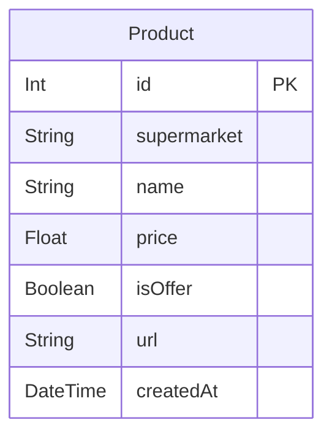
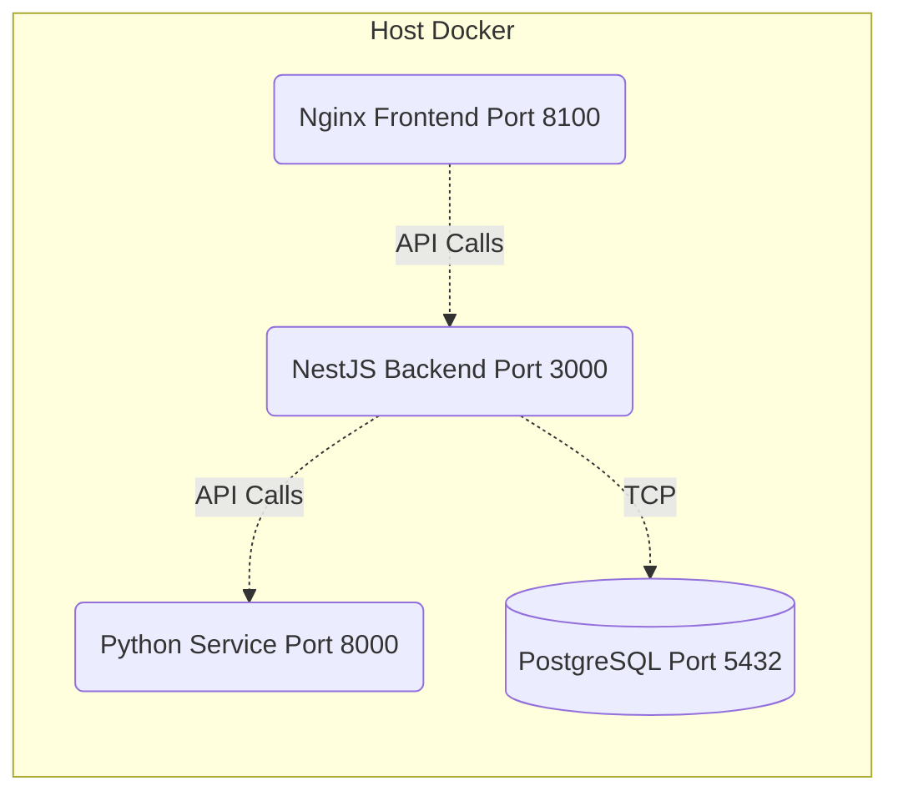

# TodoRetail - Comparador de Precios Inteligente

## 1. Nombre del Proyecto
**TodoRetail**: Plataforma inteligente de comparación de precios de supermercados.

## 2. Descripción Breve
TodoRetail automatiza la búsqueda y comparación de precios en tiempo real entre múltiples supermercados (Jumbo, Santa Isabel y Unimarc, se busca ampliar el scraping), agrupando productos idénticos para permitirle a los usuarios tomar decisiones de compra informadas y optimizar su presupuesto.

## 3. Identificación de los Integrantes
* Francisco Alfaro Flores

## 4. Distribución de Responsabilidades
* Francisco Alfaro Flores: DevOps, Infraestructura (Terraform, Docker), Arquitectura Backend (NestJS, FastAPI) y algoritmos de agrupación NLP. Desarrollo Frontend (Angular, Ionic) y UI/UX. Integración de Datos (Web Scraping en Python), testing y QA.

## 5. Problema o Necesidad Abordada
Las personas gastan tiempo y dinero intentando encontrar los mejores precios para sus compras de supermercado, visitando múltiples sitios web o locales físicos. La inflación y la variación diaria de precios dificultan saber dónde conviene comprar.

## 6. Usuarios Objetivo
Familias, estudiantes, dueños de casa y cualquier persona interesada en optimizar su presupuesto de compras mensuales y ahorrar dinero.

## 7. Objetivos del Proyecto
* Construir una plataforma centralizada para buscar productos de supermercado.
* Extraer y procesar información en tiempo real desde sitios externos.
* Agrupar productos idénticos de manera inteligente mediante análisis de lenguaje natural.
* Proveer una experiencia móvil y web de alta calidad.

## 8. Alcance y Exclusiones
* **Incluye**: Búsqueda en tiempo real en Jumbo, Santa Isabel y Unimarc. Agrupación por nombre, marca, volumen y sabor. Identificación de ofertas.
* **Excluye**: Compra directa desde la plataforma (carrito de compras nativo), integración con pasarelas de pago, cálculo de costos de envío.

## 9. Principales Funcionalidades
* Barra de búsqueda unificada.
* Despliegue de resultados agrupados mediante interfaz de acordeón.
* Visualización del precio más bajo garantizado.
* Redirección directa al supermercado para concretar la compra.

## 10. Arquitectura General y Diagramas
El sistema utiliza una arquitectura orientada a microservicios. A continuación se presentan los diagramas exigidos:

### Diagrama de Contenedores y Flujo
```mermaid
flowchart TD
    User([Usuario]) -->|Ingresa término de búsqueda| Frontend(Frontend Ionic/Angular)
    Frontend -->|HTTP GET /api/extract| Backend(API Backend NestJS)
    Backend -->|HTTP POST /extract| Python(Servicio Python FastAPI)
    Python -->|Web Scraping (Playwright)| Fuentes[(Jumbo, Santa Isabel, Unimarc)]
    Python -->|Retorna JSON estandarizado| Backend
    Backend -->|Aplica NLP y agrupa| Backend
    Backend -->|Persiste historial| DB[(PostgreSQL)]
    Backend -->|Retorna resultados| Frontend
```

### Modelo de Base de Datos


### Diagrama de Despliegue Preliminar (Docker)


## 11. Tecnologías y Herramientas Utilizadas
* **Lenguajes**: TypeScript, Python, HTML/SCSS.
* **Frameworks**: Angular, Ionic, NestJS, FastAPI.
* **DevOps**: Docker, Docker Compose, GitHub Actions, Terraform.
* **Base de Datos**: PostgreSQL, Prisma ORM.

## 12. Fuente o Fuentes de Información Web
Los datos se obtienen mediante *Web Scraping* en tiempo real desde las plataformas públicas de comercio electrónico de:
* **Jumbo** (Cencosud)
* **Santa Isabel** (Cencosud)
* **Unimarc** (SMU)

## 13. Descripción de la Capacidad Adaptativa o Inteligente
El módulo Python incluye un algoritmo NLP (Natural Language Processing) basado en reglas estrictas y similitud de Jaccard que "entiende" los nombres de los productos. Estandariza volúmenes (cc, ml, l), elimina palabras vacías ("desechable", "retornable") y previene la mezcla de variantes incompatibles (ej. "Light" vs "Normal", "Vainilla" vs "Chocolate"), logrando agrupar ofertas dispares en un solo ítem conceptual para el usuario.

## 14. Instrucciones de Instalación
1. Clonar el repositorio.
2. Copiar los archivos `.env.example` a `.env` en los directorios de backend y frontend.
3. Asegurarse de tener Docker y Docker Compose instalados.

## 15. Configuración de Variables de Entorno
Revisar el archivo `.env.example` en el backend. Principales variables:
* `DATABASE_URL`: URI de conexión a PostgreSQL.
* `PYTHON_SERVICE_URL`: URL interna del servicio de scraping (`http://python-service:8000`).

## 16. Instrucciones de Ejecución
Ejecutar el siguiente comando en la raíz del proyecto para construir y levantar todos los servicios en contenedores separados:
```bash
docker compose up --build -d
```

## 17. Instrucciones de Uso
* **Frontend**: Navegar a `http://localhost:8100`. Ingresar un término de búsqueda (ej. "leche") y explorar los resultados agrupados.
* **Backend API**: Disponible en `http://localhost:3000`.
* **Python API**: Disponible en `http://localhost:8000`.

## 18. Ejecución de Pruebas
* **Backend**: `cd backend && npm run test`
* **Python**: `cd python-service && pytest`
* El CI/CD en GitHub Actions ejecuta estas pruebas automáticamente.

## 19. Proceso de Construcción con Docker y Despliegue
* Cada componente posee su propio `Dockerfile` (el frontend y backend utilizan construcciones *multi-stage* para optimizar el peso).
* El despliegue a Staging está automatizado mediante GitHub Actions tras pasar los *Quality Gates* (TruffleHog, Trivy, Tests, Linting, Terraform Validate).

## 20. Enlaces y Documentación Adicional
* **Enlace al ambiente de Staging**: [EN CONSTRUCCIÓN]
* **Enlace al prototipo Figma**: [EN CONSTRUCCIÓN]
* **Documentación de la API**: [EN CONSTRUCCIÓN]
* **Limitaciones**: La búsqueda depende de la latencia y disponibilidad de los sitios web externos, ya que opera en tiempo real.
* **Trabajo Futuro**: Agregar más supermercados, mejorar filtros especificos por prodcuto, mejoras UI y UX, capacidad de crear cuentas para guardas productos y generar recomendaciones, implementar almacenamiento en caché (Redis) e indexación periódica para respuestas instantáneas.
